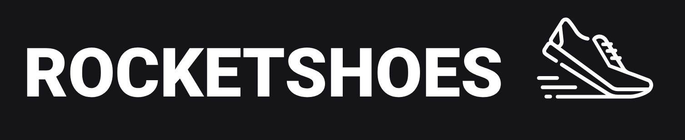

<h1 align="center">
	
</h1>

# Rocketshoes


   

## About
This repository contains the second challenge task to be completed for Rocketseat's Ignite Bootcamp, class 01. 

The challenge is creating a __e-commerce web page__ with a __fully functional client cart__. The theme for this shop is shoes!
# Table of contents
* [About](#about)
* [Table of contents](#table-of-contents)
* [Status](#status)
* [Features](#features)
* [How to install and run this application](#how-to-install-and-run-this-application)
	* [Prerequisites](#prerequisites)
	* [Installing and running](#installing-and-running)
* [Techs utilized](#techs-utilized)
* [Author and acknowledgements](#author-and-acknowledgements)
# Status
This challenge is completed and delivered to specifications. It passed all automated tests and implements all the features asked. ✅
# Features
- [x] Being able to retrieve items from the API and display them on the home screen.
- [x] Display in the header the amount of items listed in cart.
- [x] Display items currently in the cart in the cart screen, with proper amounts, prices and total price.
- [x] Adding items to the cart.
- [x] Updating items in the cart.
- [x] Removing items from the cart.
- [x] Fully functioning buttons in the application to perform the CRUD operations listed before.
- [x] Displaying appropriate error messages whenever needed.
# How to install and run this application
## Prerequisites
To run this code you will need the latest versions of [Node.js](https://nodejs.org/en/) and [Yarn](https://yarnpkg.com/) installed on your machine.
## Installing and running
```bash
# Clone this respository
$ git clone <https://github.com/Gabriel-f-r-bojikian/Rocketshoes.git>

# Move into the newly created folder
$ cd Rocketshoes

# Install all dependencies
$ yarn

# Run the server
$ yarn server

# Run the application
$ yarn start
```
# Techs utilized
The following technologies were used for the completion of this challenge:
- 
- 
- 
- 
- 
- 
- 

# Author and Acknowledgements
The original code was done by [Rocketseat](https://rocketseat.com.br/) 🚀. All modifications in this repository were made by me, Gabriel Fernandes. 💪

My links for contact are:
[](https://github.com/Gabriel-f-r-bojikian) [](https://www.linkedin.com/in/gabriel-fernandes-rosa-bojikian-688b84164/) [](mailto:gabriel.f.r.bojikian@gmail.com)